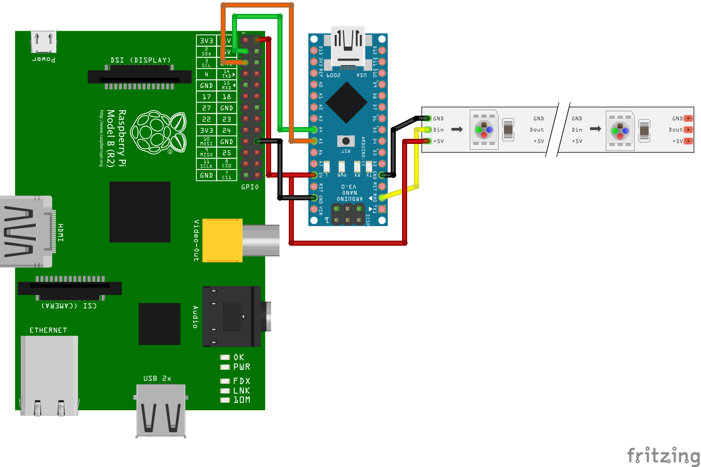

# Node-Pixel Installation Guide

## Considerations

Depending on the board you are using and what you are trying to achieve, there
are two ways of using node-pixel.

The `custom firmata` method assumes you are using an arduino and you just want
to add addressable LED support to the way firmata works already. This is a good
option if you want to play with NeoPixels and you aren't doing much more than
controlling LEDs. The downside of this approach is that Firmata has a lot of
support already in it for a range of devices so you will be limited in the number
of pixels you can control. In addition, the pixel libary will block at times, so your
framerate will always be limited.

The `backpack` method provides I2C support to a strip of WS2812 pixels and will work
with any [board that has I2C IO support](http://johnny-five.io/platform-support/).
The benefit of this approach is that it offloads the LED processing to a dedicated
board and can support more pixels and much higher framerate. The downside is you will
require an arduino or other atmega board of some type (eg Pro Mini, Nano etc) to
run the pixels. These boards can be had for about $2 with a bit of searching.

## Prerequisites

It is assumed you have an [Arduino](http://arduino.cc/en/Guide/HomePage) and
the IDE installed (both methods rely on at least one arduino compatible board).

For the purposes of this guide I will assume you're using Adafruit NeoPixels and I'm going
to assume you've read the [NeoPixel Uber Guide](http://learn.adafruit.com/adafruit-neopixel-uberguide/overview)
as it has just about everything you need to know in it from a hardware perspective.
Standard WS2812b LEDs from any other supplier will work just as well.

I'm going to assume you have NodeJS all ready to go too and you've gone through
the [Johnny-Five getting started guide](http://johnny-five.io).

### Get the node-pixel code

#### Option 1: Clone this repo

Simply clone this repo and everything is here for you.

```
git clone https://github.com/ajfisher/node-pixel
cd node-pixel
npm install
```

Firmware will be located in `firmware/build/`

#### Option 2: NPM

This will put everything in the node_modules folder and will include the firmware
so you just need to know where to look to find it.

```
npm install node-pixel
```

Firmware will be located in `node_modules/node-pixel/firmware/build`

## Custom Firmata Installation

This installation method assumes you have a single Arduino and you install the
custom firmata on it.

Open up the arduino IDE, navigate to the `firmware/build/node_pixel_firmata/`
folder and open up `node_pixel_firmata.ino`. This will bring in all the requirements you
need as well.

Simply compile and upload to your arduino. Assuming no errors, you're good to go.

### Hardware installation

With the hardware off, attach your pixels to the arduino. Usually this involves
getting a 5V source, a ground and then attaching the data line to an arduino
digital pin. The default configuration assumes PIN 6 however this is configurable.

_Wiring diagram_


## I2C Backpack Installation

This installation method installs a custom "Backpack" firmware onto an arduino
Nano or Pro Mini which is then connected to the board using I2C connections.

Open up the arduino IDE, navigate to `firmware/build/backpack/` and open `backpack.ino`.
This will bring in all the required dependencies.

Note that before you compile you may need to change your board type and port
if you are used to using only Uno boards.

Compile, check for errors and then upload to your arduino. Assuming no errors
you should be ready to go.

### Hardware installation

For the purposes of this `Board` will mean the board that is talking to NodeJS
and `Backpack` will mean the custom arduino used to provide I2C support.

With the hardware off, attach your pixels to the Backpack. Usually this involves
getting a 5V source, a ground and then attaching the data line to an arduino
digital pin. The default configuration assumes PIN 6 (NOTE this is NOT configurable).

Connect the grounds of the Board and Backpack as well as the SDA and SCK pins. (You
will need to look at your board and backpack pin out diagrams to see what these are).

Depending on your Board you may be able to power the Backpack by providing 5V out
to the 5v pin on the Backpack or you may need to supply that separately.

*Note: Because of an [I2C bug](http://www.advamation.com/knowhow/raspberrypi/rpi-i2c-bug.html) 
you must change the I2C baudrate on the Raspberry Pi and Pi 2. Edit `/boot/config.txt` 
to include the following line and reboot your Pi:*

```bash
dtparam=i2c_arm_baudrate=10000
```



## Using the library

Now you're set up, it's time to use some JS to manipulate the LEDs.

To use the library, require it per normal:

```
var pixel = require("node-pixel");
```

The [main readme](../README.md) has more detailed instructions around the api.

